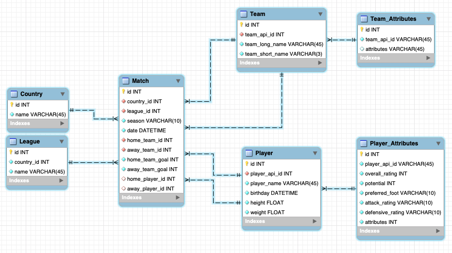

# European Football APP

## Purpose
This is a Flask website app about European football clubs and players in the eleven major leagues during the season 2008/2009 and 2015/2016. There are three main parts for this app. The first part lets the user choose a team he wants to search. The second part shows some information about the team the user searched. There are 12 attributes for a team, play speed, dribbling, passing, positioning, passing creation, crossing creation, shooting creating, positioning creation, defence pressure, defence aggression, team width and defender line class. The attributes are displayed in radio graph and list format. The third part is about the players. The user can select the player he interested in from the squad list in the second part. Then some information about the player are displayed, like height, weight, age and other attributes. There are total 39 attributes for a player. The attributes are displayed in radio graph.

## Data source
The database contains 7 tables, Country, League, Match, Player, Player_Attributes, Team and Team_Attributes. There are some many-to-many relationships in this database. For example, a match can have two teams to start and a team can play in many matches, a match can have more than 22 players and a player can participate in many matches. The database is developed from a Kaggle dataset [European Soccer Database](https://www.kaggle.com/hugomathien/soccer) and [web](https://sofifa.com/players/hot?showCol=pi) crawled data about player and club attributes. The total records crawled is over 20000 and the crawling time may be longer than half an hour. To craw the data and build the database again, just run the two Python files under crawl directory. Since this is rather time consuming, I uploaded the complete databse called soccer.zip for anyone who want to run this App. 

## Data model

:warning: The Player_Attributes and Team_Attributes tables are not complete. Because there are too many fields to type in. I just used attributes to represent all the attribute fields in the original table since they are just simple index of the table and does not involve in any key relationships.

## Code structure
There are two major files, app.py and model.py. The app.py file basically controls the routes for this App and model.py provides functions for app.py to access the database. There are two parts in models.py that are relatively tricky. The first one is how to draw win/lose records using Plotly. Since there are no direct information about win/lose records in the database, the only way to obtain this information is to comparing the team's goals with the opponent's. The two funcitons get_match_home_records(team_id) and get_match_away_records(team_id) in model.py finished this job. To draw the win/lose records using Plotly, I classified all wining matches, tie matches and lose matches to 3, 1 and 0. Then use the line graph to plot this info. The next one is how to get the squad list. Again there is no direct squad list in this database. I have to use the player fields in the Match table to get the players for a club in a specific season. The get_squad(team_id) function in model.py should do this. Then I have to use Python code to get the unique squad list because the players obtained in the last step contains repetition, which is implemented as get_unique_player(player_tuple1, player_tuple2) in model.py. There is a player class which is initiated by play's unique id. This class contains functions to return various information about a player. 

## User Guide
1. Clone this repo to your preferred directory.
```commandline
$ git clone https://github.com/Blackpassat/SI507_Final_Project.git
```
2. Start a virtualenv with your preferred name and start your virtualenv.
```commandline
$ virtualenv <name>
$ source <name>/bin/activate
```
3. Install all the fields in requirements.txt.
```commandline
$ pip install -r requirements.txt
```
4. Unzip the database.
5. Run the app.py file to start the App.
```commandline
$ python app.py
```
6. Go to 127.0.0.1:5000 to play with the App